# Enterprise Network Infrastructure Lab using Cisco Packet Tracer

## Overview

This project demonstrates the design and implementation of a secure enterprise network for a small company using Cisco Packet Tracer. The network is segmented into multiple VLANs to separate departments, while Router-on-a-Stick enables controlled communication between VLANs. Security best practices, including Access Control Lists (ACLs), Port Security, and unused port protection, are implemented to secure the network. Additionally, an FTP File Server provides centralized file sharing for employees.

---

## Scenario

A small company consists of four departments:

- Administration
- Human Resources (HR)
- IT Department
- File Server

Each department is placed in its own VLAN to improve security and reduce broadcast traffic. Employees receive IP addresses automatically using DHCP, while the IT department is responsible for managing network resources. A centralized FTP server is available for authorized departments to share files.

---

## Network Topology

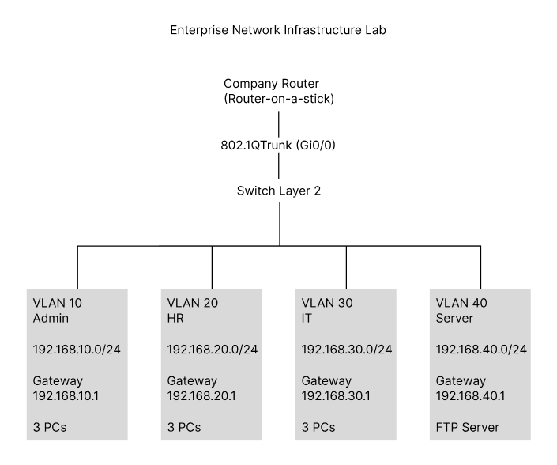

---

# Network Addressing

| VLAN | Department | Network | Default Gateway |
|------|------------|-----------------|----------------|
| 10 | Administration | 192.168.10.0/24 | 192.168.10.1 |
| 20 | Human Resources | 192.168.20.0/24 | 192.168.20.1 |
| 30 | IT Department | 192.168.30.0/24 | 192.168.30.1 |
| 40 | File Server | 192.168.40.0/24 | 192.168.40.1 |

---

# Features Implemented

- VLAN Segmentation
- 802.1Q Trunking
- Router-on-a-Stick
- Inter-VLAN Routing
- IPv4 Addressing & Subnetting
- DHCP Configuration
- Access Control Lists (ACLs)
- Port Security (Sticky MAC)
- Unused Port Security (VLAN 999)
- FTP File Server
- Server Access Control
- Network Troubleshooting & Verification

---

# Implementation

The following screenshot shows the complete enterprise network implemented in Cisco Packet Tracer.

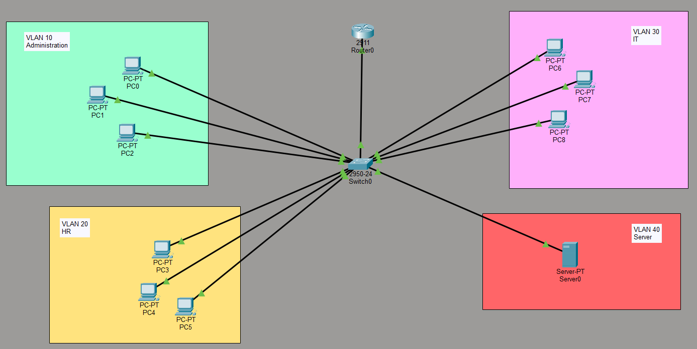

## 1. VLAN Segmentation

Created separate VLANs for each department to isolate broadcast domains and improve security.

### VLAN Configuration

Created separate VLANs to logically segment the network by department. Each VLAN was assigned a dedicated IPv4 subnet and switch access ports.

| VLAN ID | Department | Network |
|---------|------------|-----------------|
| 10 | Administration | 192.168.10.0/24 |
| 20 | Human Resources | 192.168.20.0/24 |
| 30 | IT Department | 192.168.30.0/24 |
| 40 | File Server | 192.168.40.0/24 |
| 999 | Unused Ports | N/A |

Switch access ports were assigned to their respective VLANs, while unused ports were placed in VLAN 999 and administratively shut down as a security measure.

Verification:

```bash
show vlan brief
```

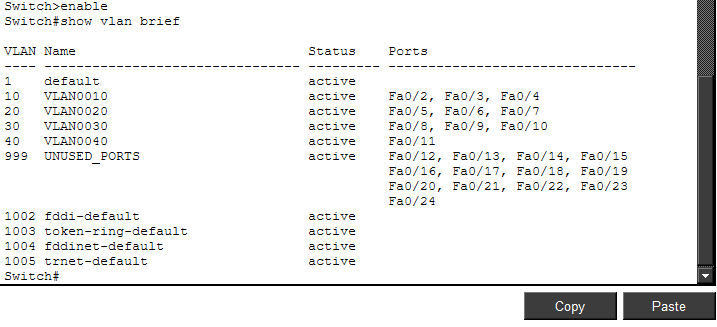

## 2. 802.1Q Trunking

Configured the switch-to-router connection as an IEEE 802.1Q trunk to carry traffic from multiple VLANs over a single physical interface.

Verification:

```bash
show interfaces trunk
```

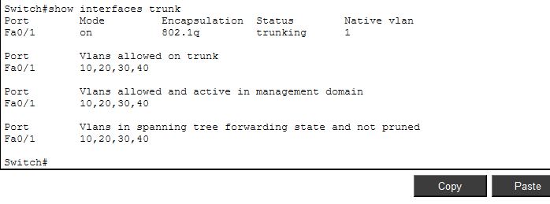

---

## 3. Router-on-a-Stick

Configured router subinterfaces for each VLAN.

Example:

```text
GigabitEthernet0/0.10
192.168.10.1

GigabitEthernet0/0.20
192.168.20.1

GigabitEthernet0/0.30
192.168.30.1

GigabitEthernet0/0.40
192.168.40.1
```

Each subinterface acts as the default gateway for its VLAN.

Verification:

```bash
show ip interface brief
```

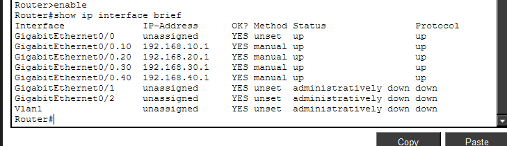

---

## 4. Inter-VLAN Routing

Implemented Router-on-a-Stick to enable communication between VLANs while allowing security policies to control traffic.

Verification:

- Successful ping tests
- ACL enforcement between departments

---

## 5. DHCP

Configured the router as the DHCP server.

Implemented:

- DHCP Pools
- Default Gateway Assignment
- DNS Configuration
- Excluded Static Addresses

Verification:

```bash
show ip dhcp binding

show ip dhcp pool
```

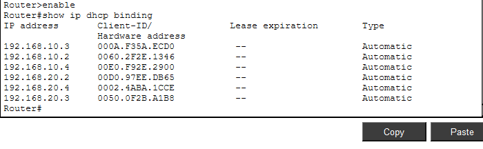

---

## 6. Access Control Lists (ACLs)

Implemented named Extended ACLs to enforce department-based access control.

### Security Policy

- Admin cannot access HR or IT
- HR cannot access Admin or IT
- IT can access all departments
- All departments can access the File Server
- Unauthorized networks are denied access to the File Server

Verification:

```bash
show access-lists
```

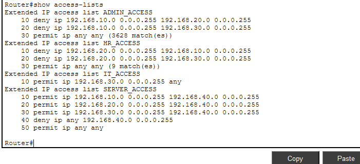

---

## 7. Port Security

Configured Port Security on all access ports using Sticky MAC Address learning.

Configuration includes:

- Maximum 1 MAC address per port
- Sticky MAC Learning
- Shutdown violation mode

Verification:

```bash
show port-security

show port-security address
```

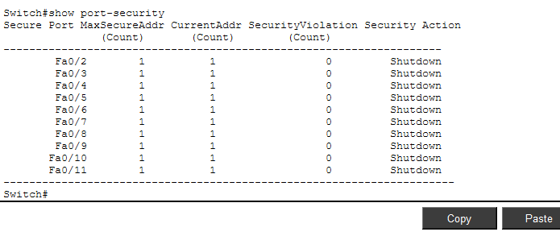

---

## 8. Unused Port Security

To prevent unauthorized devices from connecting:

- Created VLAN 999
- Assigned unused ports to VLAN 999
- Administratively shut down all unused ports

Verification:

```bash
show vlan brief

show interfaces status
```

---

## 9. FTP File Server

Configured a centralized FTP server inside VLAN 40 for secure file sharing.

Features:

- Static IP Address
- FTP Service Enabled
- User Authentication
- Shared File Storage

### FTP Server Configuration

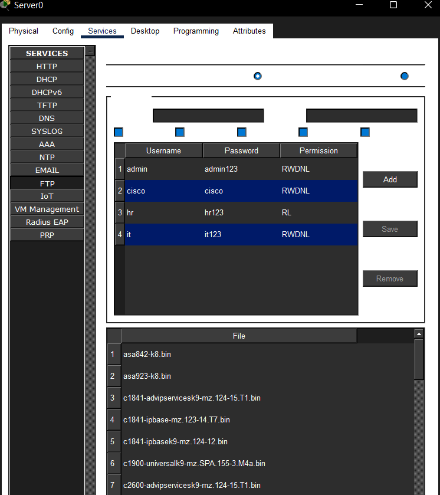

### FTP Client Verification

The following screenshot demonstrates a successful FTP connection from a client to the server.

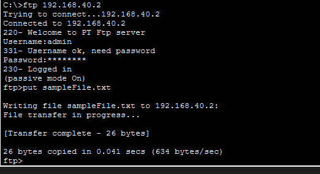

---

## 10. Network Verification

The following commands were used to verify the network configuration:

```bash
show vlan brief

show interfaces trunk

show ip interface brief

show ip dhcp binding

show access-lists

show port-security

show mac address-table

ping

ftp
```

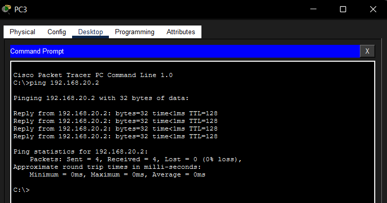

---

# Security Features

- VLAN Segmentation
- Department Isolation
- Extended ACLs
- Port Security
- Sticky MAC Learning
- Shutdown Violation Mode
- Disabled Unused Switch Ports
- VLAN 999 for Unused Ports
- Protected File Server

---

# Skills Demonstrated

- Cisco IOS Configuration
- Enterprise Network Design
- VLAN Segmentation
- IEEE 802.1Q Trunking
- Router-on-a-Stick
- Inter-VLAN Routing
- IPv4 Addressing
- DHCP
- Extended Access Control Lists (ACLs)
- Port Security
- FTP Server Configuration
- Network Security
- Network Troubleshooting

---

# Future Improvements

- Implement NAT/PAT for Internet access
- Configure Dynamic Routing (OSPF)
- Deploy a DNS Server
- Add SSH for secure device management
- Implement Syslog and NTP
- Integrate Windows Server Active Directory

---

# Author

**Sohila Akram**

Computer Science Graduate | IT Support & Networking Enthusiast


